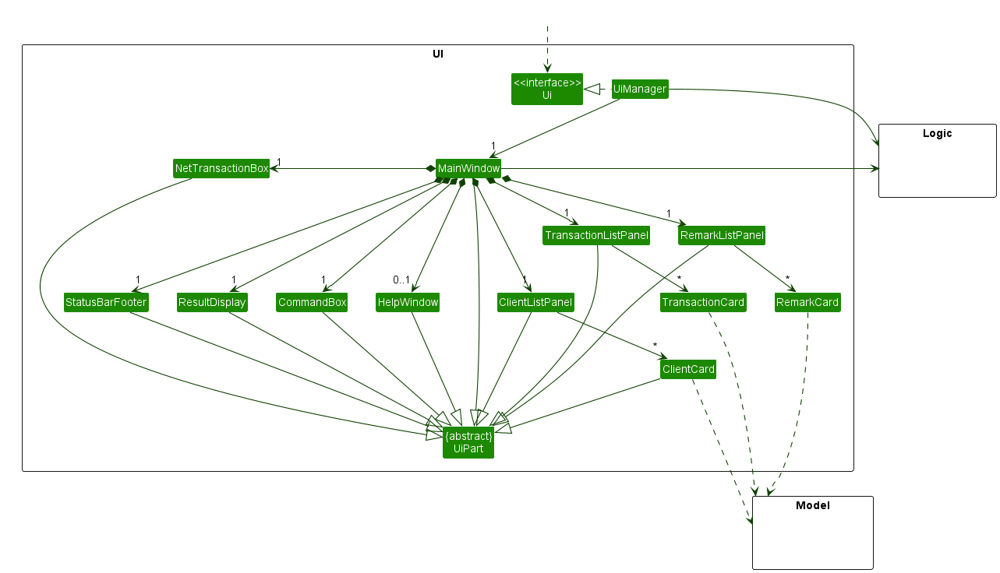
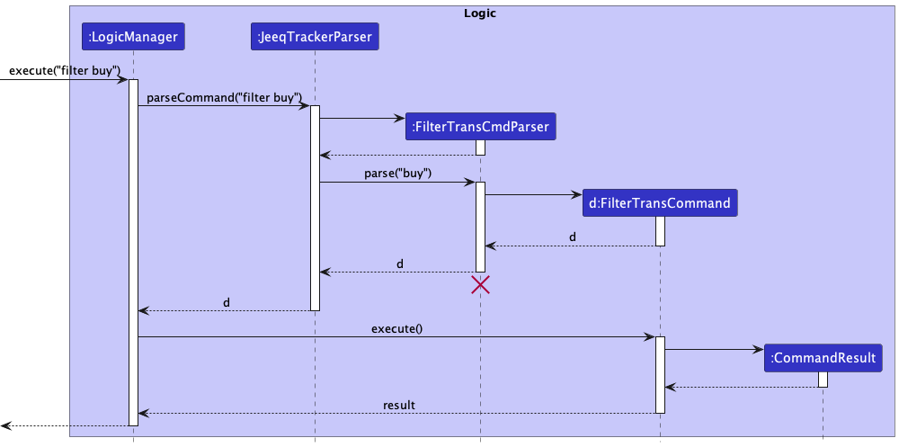
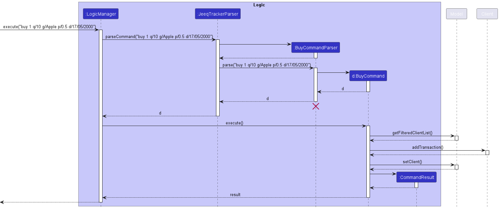
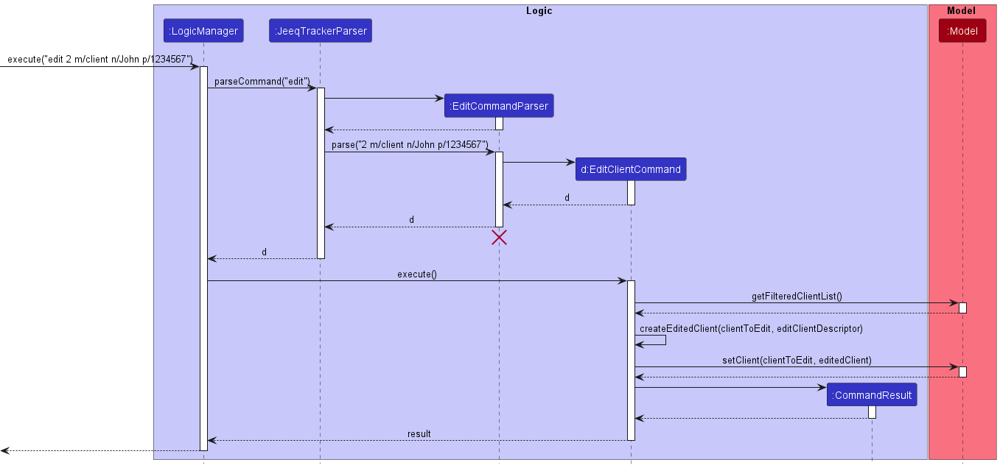
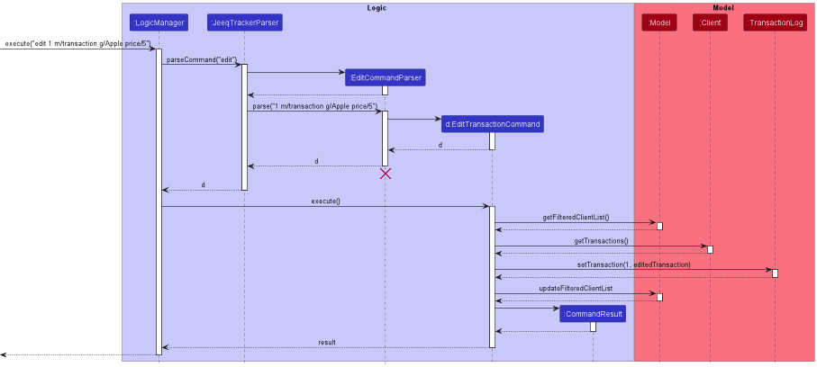
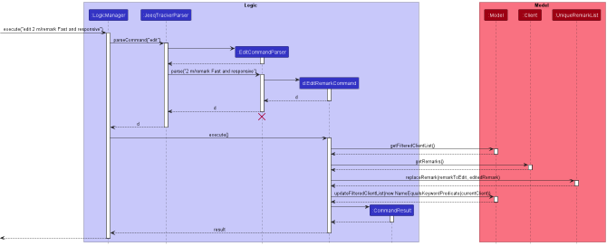
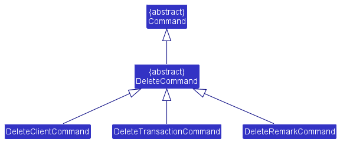
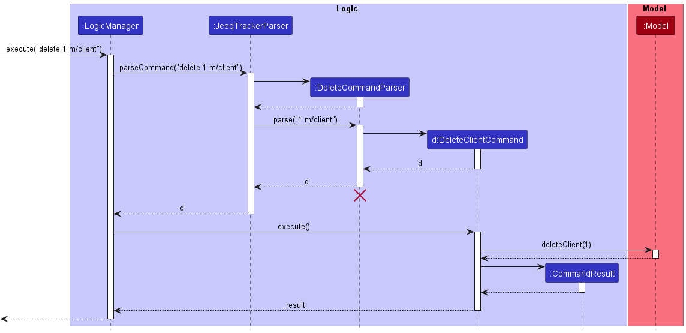
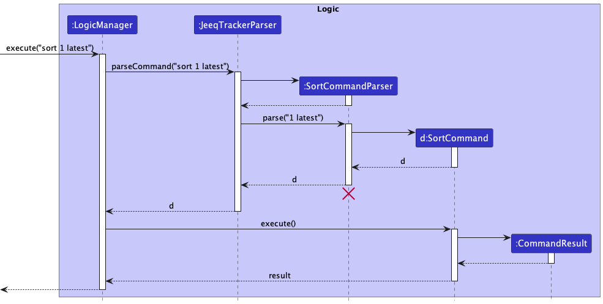
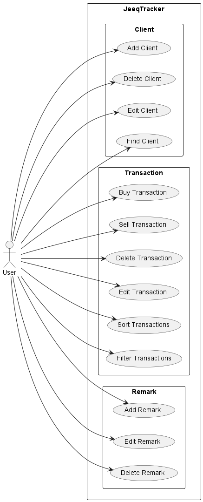

## Table of Contents
* [Acknowledgements](#acknowledgements)
* [Setting up, getting started](#setting-up-getting-started)
* [Design](#design)
    * [Architecture](#architecture)
    * [UI component](#ui-component)
    * [Logic component](#logic-component)
    * [Model component](#model-component)
    * [Storage component](#storage-component)
    * [Common classes](#common-classes)
* [Implementation](#implementations)
    * [Filter transaction feature](#filter-feature-for-transactions)
    * [Buy / Sell transaction feature](#buysell-feature-for-transactions)
    * [Editing client feature](#editing-client-feature)
    * [Editing transactions feature](#editing-transactions-feature)
    * [Editing remarks feature](#editing-remarks-feature)
    * [Delete Client/Transaction/Remark feature](#delete-clienttransactionremark-feature)
    * [Sort feature](#sort-feature)
* [Documentation, logging, testing, configuration, dev-ops](#documentation-logging-testing-configuration-dev-ops)
* [Appendix: Requirements](#appendix-requirements)
    * [Product Scope](#product-scope)
    * [User Stories](#user-stories)
    * [Use cases](#use-cases)
      * [Delete a client](#use-case-uc01---delete-a-client)
      * [Delete a transaction](#use-case-uc02---delete-a-transaction)
      * [Delete a remark](#use-case-uc03---delete-a-remark)
      * [Find a client](#use-case-uc04---find-a-client)
      * [Add a remark to a client](#use-case-uc05---add-a-remark-to-a-client)
      * [Requesting help](#use-case-uc06---requesting-help)
      * [Clearing all data](#use-case-uc07---clearing-all-data)
      * [Buying from a client](#use-case-uc08---buying-from-a-client)
      * [Selling to a client](#use-case-uc09---selling-to-a-client)
      * [Sorting a client](#use-case-uc10---sort-client-by-latest-transaction-br)
      * [Edit a client](#use-case-uc11---edit-a-client)
      * [Edit a transaction](#use-case-uc12---edit-a-transaction)
      * [Edit a remark](#use-case-uc13---edit-a-remark)
    * [Non-Functional Requirements](#non-functional-requirements)
    * [Glossary](#glossary)
* [Appendix: Instructions for manual testing](#appendix-instructions-for-manual-testing)
  * [Launch and shutdown](#launch-and-shutdown)
  * [Viewing a client](#viewing-a-client)
  * [Delete a client](#deleting-a-client)
  * [Delete a transaction](#deleting-a-transaction)
  * [Delete a remark](#deleting-a-remark)
  * [Filtering transactions](#filtering-transactions-from-all-clients)
  * [Editing a client](#editing-a-client)
  * [Editing a transaction](#editing-a-transaction)
  * [Editing a remark](#editing-a-remark)
  * [Sort a client](#sorting-transactions-of-a-client)
  * [Adding buy/sell transactions](#adding-buysell-transactions)
  * [Help command](#help-command)
  * [Saving data](#saving-data)

--------------------------------------------------------------------------------------------------------------------

## **Acknowledgements**

This project is based on the **AddressBook-Level3** project created by the **[SE-EDU initiative](https://se-education.org)**

The following are some **reused/adapted** ideas, code, and documentation from AB3:
* `client` is inspired from [Person](https://github.com/nus-cs2103-AY2223S1/tp/blob/master/src/main/java/seedu/address/model/person/Person.java)
* `find` is reused
* The User Interface is adapted from [AB3](https://github.com/nus-cs2103-AY2223S1/tp/blob/master/src/main/resources/view/MainWindow.fxml)
* Developer Guide is built up from [AB3](https://se-education.org/addressbook-level3/DeveloperGuide.html)

--------------------------------------------------------------------------------------------------------------------

## **Setting up, getting started**

Refer to the guide [_Setting up and getting started_](SettingUp.md).

--------------------------------------------------------------------------------------------------------------------

## **Design**

:bulb: **Tip:** The `.puml` files used to create diagrams in this document can be found in the [diagrams](https://github.com/se-edu/addressbook-level3/tree/master/docs/diagrams/) folder. Refer to the [_PlantUML Tutorial_ at se-edu/guides](https://se-education.org/guides/tutorials/plantUml.html) to learn how to create and edit diagrams.

### Architecture

The ***Architecture Diagram*** given above explains the high-level design of the App.

Given below is a quick overview of main components and how they interact with each other.

**Main components of the architecture**

**`Main`** has two classes called [`Main`](https://github.com/AY2223S1-CS2103T-T09-1/tp/blob/master/src/main/java/seedu/address/Main.java) and [`MainApp`](https://github.com/AY2223S1-CS2103T-T09-1/tp/blob/master/src/main/java/seedu/address/MainApp.java). It is responsible for,
* At app launch: Initializes the components in the correct sequence, and connects them up with each other.
* At shut down: Shuts down the components and invokes cleanup methods where necessary.

[**`Commons`**](#common-classes) represents a collection of classes used by multiple other components.

The rest of the App consists of four components.

* [**`UI`**](#ui-component): The UI of the App.
* [**`Logic`**](#logic-component): The command executor.
* [**`Model`**](#model-component): Holds the data of the App in memory.
* [**`Storage`**](#storage-component): Reads data from, and writes data to, the hard disk.

**How the architecture components interact with each other**

The *Sequence Diagram* below shows how the components interact with each other for the scenario where the user issues the command `delete 1`.

Each of the four main components (also shown in the diagram above),

* defines its *API* in an `interface` with the same name as the Component.
* implements its functionality using a concrete `{Component Name}Manager` class (which follows the corresponding API `interface` mentioned in the previous point.

For example, the `Logic` component defines its API in the `Logic.java` interface and implements its functionality using the `LogicManager.java` class which follows the `Logic` interface. Other components interact with a given component through its interface rather than the concrete class (reason: to prevent outside component's being coupled to the implementation of a component), as illustrated in the (partial) class diagram below.

The sections below give more details of each component.

### UI component

The **API** of this component is specified in [`Ui.java`](https://github.com/se-edu/addressbook-level3/tree/master/src/main/java/seedu/address/ui/Ui.java)

The UI consists of a `MainWindow` that is made up of parts (`CommandBox`, `ResultDisplay`, `ClientListPanel`, `TransactionListPanel`, `RemarkListPanel`, `StatusBarFooter`, `HelpWindow`, `NetTransactionBox`). All these, including the `MainWindow`, inherit from the abstract `UiPart` class which captures the commonalities between classes that represent parts of the visible GUI.

The `ClientListPanel`, `TransactionListPanel`, `RemarkListPanel` contains `ClientCard`, `TransactionCard`, `RemarkCard` respectively. These **panels** can hold any number of their respective **card**. These cards also inherit from the abstract `UiPart`, and represents the GUI of a single Client, Transaction, or Panel.

The `UI` component uses the JavaFx UI framework. The layout of these UI parts are defined in matching `.fxml` files that are in the `src/main/resources/view` folder. For example, the layout of the [`MainWindow`](https://github.com/AY2223S1-CS2103T-T09-1/tp/blob/master/src/main/java/seedu/address/ui/MainWindow.java) is specified in [`MainWindow.fxml`](https://github.com/AY2223S1-CS2103T-T09-1/tp/blob/master/src/main/resources/view/MainWindow.fxml)

The `UI` component,

* executes user commands using the `Logic` component.
* listens for changes to `Model` data so that the UI can be updated with the modified data.
* keeps a reference to the `Logic` component, because the `UI` relies on the `Logic` to execute commands.
* depends on some classes in the `Model` component, as it displays `Client`, `Transaction`, and `Remark` object residing in the `Model`.

### Logic component

**API** : [`Logic.java`](https://github.com/se-edu/addressbook-level3/tree/master/src/main/java/seedu/address/logic/Logic.java)

Here's a (partial) class diagram of the `Logic` component:

How the `Logic` component works:
1. When `Logic` is called upon to execute a command, it uses the `JeeqTrackerParser` class to parse the user command.
1. This results in a `Command` object (more precisely, an object of one of its subclasses e.g., `AddCommand`) which is executed by the `LogicManager`.
1. The command can communicate with the `Model` when it is executed (e.g. to add a client).
1. The result of the command execution is encapsulated as a `CommandResult` object which is returned back from `Logic`.

The Sequence Diagram below illustrates the interactions within the `Logic` component for the `execute("delete 1")` API call.

:information_source: **Note:** The lifeline for `DeleteCommandParser` should end at the destroy marker (X) but due to a limitation of PlantUML, the lifeline reaches the end of diagram.

Here are the other classes in `Logic` (omitted from the class diagram above) that are used for parsing a user command:

How the parsing works:
* When called upon to parse a user command, the `JeeqTrackerParser` class creates an `XYZCommandParser` (`XYZ` is a placeholder for the specific command name e.g., `AddCommandParser`) which uses the other classes shown above to parse the user command and create a `XYZCommand` object (e.g., `AddCommand`) which the `JeeqTrackerParser` returns back as a `Command` object.
* All `XYZCommandParser` classes (e.g., `AddCommandParser`, `DeleteCommandParser`, ...) inherit from the `Parser` interface so that they can be treated similarly where possible e.g, during testing.

### Model component
**API** : [`Model.java`](https://github.com/AY2223S1-CS2103T-T09-1/tp/blob/master/src/main/java/seedu/address/model/Model.java)

The `Model` component,

* stores the address book data i.e., all `Client` objects (which are contained in a `UniqueClientList` object).
* stores the currently 'selected' `Client` objects (e.g., results of a search query) as a separate _filtered_ list which is exposed to outsiders as an unmodifiable `ObservableList<Client>` that can be 'observed' e.g. the UI can be bound to this list so that the UI automatically updates when the data in the list change.
* stores a `UserPref` object that represents the user’s preferences. This is exposed to the outside as a `ReadOnlyUserPref` objects.
* does not depend on any of the other three components (as the `Model` represents data entities of the domain, they should make sense on their own without depending on other components)

:information_source: **How Transaction and Remark are modelled:** 
The diagrams below show the Transaction and Remark Model and how they are stored in Client.   

**`Transaction` Class  **
Each `Client` Class has a `TransactionLog` which stores all transactions of the client in a List. The `Transaction` object contains the `Goods` transacted,
`Price` of the goods, `Quantity` of goods and `Date` of the transaction.  
  

**`Remark` Class  **
Each `Client` Class has a `UniqueRemarkList` which stores `Remark` object that do not 
have the same `Text` (case-insensitive). The `Remark` object contains the 
`Text` which represents the remark's text.  
 

### Storage component

**API** : [`Storage.java`](https://github.com/AY2223S1-CS2103T-T09-1/tp/blob/master/src/main/java/seedu/address/storage/Storage.java)

The `Storage` component,

* can save both jeeqtracker data and user preference data in json format, and read them back into corresponding objects.
* inherits from both `JeeqTrackerStorage` and `UserPrefStorage`, which means it can be treated as either one (if only the functionality of only one is needed).
* depends on some classes in the `Model` component (because the `Storage` component's job is to save/retrieve objects that belong to the `Model`)

### Common classes

Classes used by multiple components are in the `seedu.jeeqtracker.commons` package.

--------------------------------------------------------------------------------------------------------------------

## **Implementations**

This section describes some noteworthy details on how certain features are implemented.

### Filter feature for transactions

#### Implementation

The filter transaction mechanism is facilitated by `FilterTransCommand` which extends from `Command` and `FilterTransCmdParser` which extends from `Parser`. To invoke the filter command, `FilterTransCmdParser` will parse the arguments from the user input via `FilterTransCmdParser#parse()` and returns the filter command if the arguments are valid.

`FilterTransCommand` calls the `FilterTransCommand#execute()` operation which executes the command and returns the result message in a `CommandResult` object.

The operation is exposed in the `Logic` interface as `Logic#execute()`.

Given below is an example usage scenario and how the filter mechanism behaves at each step.

Step 1. The user launches the application. The `UiManager` will call on the `MainWindow` to invoke the UI which displays all the clients.

Step 2. The user executes `filter buy` command to filter all the buy transactions from all the clients. This is done by calling the
`Client#getBuyTransactionList()` which returns an unmodifiable view of the buy transaction list.

Step 3. The `CommandResult` of `FilterTransCommand` will call `MainWindow#handleFilterTransaction()`,
to display only the filtered buy transactions from the `Client#getBuyTransactionList()` while the client panel list will display all the clients.

The following sequence diagram shows how the filter operation works:

:information_source: **Note:** The lifeline for `FilterTransCommand` should end at the destroy marker (X) but due to a limitation of PlantUML, the lifeline reaches the end of diagram.

The following activity diagram summarizes what happens when a user executes the filter command:

#### Design considerations:

**Aspect: How filter transaction executes:**

* **Alternative 1 (current choice):** Filter all the transactions made by all the clients.
    * Pros: Easy to implement and allow the user to see all the buy or sell transactions at one glance.
    * Cons: May have performance issues due to searching through all transactions of each client. Unable distinguish which transaction belong to which client.

* **Alternative 2:** Individual filter transaction for each client.
    * Pros: Performs faster as the command only filters through one client transactions. Also, user would be able to know which client the filtered transactions are from.
    * Cons: User would have to manually select each client and filter the transactions.

### Buy/Sell feature for transactions

#### Implementation for Buy Transaction

The buy transaction mechanisms are facilitated by `BuyCommand`. The `BuyCommand` extends `Command` and `BuyCommandParser` which extends from `Parser`.
To invoke either of the commands, `BuyCommandParser` will parse the arguments from the user input via `BuyCommandParser#parse()` or and returns the buy command if the arguments are valid.

`BuyCommand` executes the `BuyCommand#execute()` operation which executes the command and returns the result message in a 
`CommandResult` object.

The operation is exposed in the `logic` interface as `Logic#execute()`.

Given below is an example usage scenario and how the buy transaction mechanism behaves at each step.

Step 1. The user launches the application. The `UiManager` will call on the `MainWindow` to invoke the UI which displays the clients.

Step 2. The user executes `buy 1 q/10 g/Apple p/0.5 d/17/05/2000` command to add a buy transaction of 10 apples at $0.50 each on 17/05/2000 to the
client at index 1. This is done by calling the `BuyCommand#execute()` which will call `Model#getFilteredClientList()` to get the list of clients.

Step 3. `List<Client>#get()` is called to get the client at the index. The `BuyTransaction` is then added to the copied client by calling `Client#addTransaction(Transaction)`.
The copied client is replaced with the client at the index by calling `Model#setClient(Client, Client)`.

The following sequence diagrams shows how the buy operation works:

:information_source: **Note:** The lifeline for `BuyCommand` should end at the destroy marker (X) but due to a limitation of PlantUML, the lifeline reaches the end of diagram.

 

The following activity diagram summarizes what happens when a user executes the buy command:

#### Design considerations:

**Aspect: How buy transaction executes:**

* **Alternative 1 (current choice):** Add buy transaction into each client.
    * Pros: Easy to implement and allows the user to view all the buy transactions for each client via view command.
    * Cons: Users cannot see all buy transaction of every client at one time.
* **Alternative 2:** Add buy transaction to JeeqTracker instead of per client.
    * Pros: Easy to see every past buy transaction with all the clients.
    * Cons: Users may be overwhelmed if there are too many transactions. Also, users would be unable to tell which buy transaction belongs to which client.

#### Implementation for Sell Transaction

Similar to Buy Transaction.

_{more aspects and alternatives to be added}_

--------------------------------------------------------------------------------------------------------------
### Editing client feature
#### Current Implementation
The edit client mechanism is facilitated by EditClientCommand which extends from `EditCommand` (which extends from `Command`) and
`EditCommandParser` which extends from `Parser`. To invoke the edit command, `EditCommandParser` will parse the arguments from user input with
`EditCommandParser#parse()` and returns the edit command if the arguments are valid.

`EditTransactionCommand` implements the `EditClientCommand#execute()` operation which executes the command and returns the result
message in a `CommandResult` object.

The operation is exposed in the `Logic` interface as `Logic#execute()`.

Given below is the usage scenario and how the edit mechanism behaves at each step.

Step 1. The user launches the application. The `UiManager` will call on the `MainWindow` to invoke the UI which displays the clients.

Step 2. The user executes `edit 2 m/client n/John p/1234567` command to edit the information of the client at index 2 in the current Client list displayed on the left panel.
This is done by and executing `Model#setClient(clientToEdit, editedClient)`

The following sequence diagram shows how the edit client operation works in Logic Manager:

The following activity diagram summarizes what happens when a user executes the edit command:

#### Design considerations:

**Aspect: How edit Client executes:**

* **Alternative 1 (current choice):** Edit client by using model to update filtered client list.
    * Pros: Easy to implement and allow the user to edit the client displayed on the left client lis panel.
    * Cons: Users can only edit clients they can see in the current displayed list.
* **Alternative 2:** Edit client using their index within a list of all clients in JeeqTracker.
    * Pros: Be able to edit any client even if they are not displayed.
    * Cons: Users will take a long time navigating through the list of all client to find the index of the client they want to edit.

### Editing transactions feature
#### Current Implementation

The edit transaction mechanism is facilitated by EditTransactionCommand which extends from `EditCommand` (which extends from `Command`) and
`EditCommandParser` which extends from `Parser`. To invoke the edit command, `EditCommandParser` will parse the arguments from user input with
`EditCommandParser#parse()` and returns the edit command if the arguments are valid.

`EditTransactionCommand` implements the `EditTransactionCommand#execute()` operation which executes the command and returns the result
message in a `CommandResult` object.

The operation is exposed in the `Logic` interface as `Logic#execute()`.

Given below is the usage scenario and how the edit mechanism behaves at each step.

Step 1. The user launches the application. The `UiManager` will call on the `MainWindow` to invoke the UI which displays the clients.

Step 2. The user executes `view 1` command to focus on the client at index 1 and see the client's list of transactions.

Step 3. The user executes `edit 1 m/transaction g/Apple price/5` command to edit the name of goods and price of transaction at index 1 in the focused client's transaction list.
This is done by accessing the `TransactionLog` of the focused client, and executing `TransactionLog#setTransaction(index, editedTransaction)`

The following sequence diagram shows how the edit transaction operation works in Logic Manager:

The activity diagram for this feature is the same as that of the [Editing client feature](#editing-client-feature)

#### Design considerations:

**Aspect: How edit transaction executes:**

* **Alternative 1 (current choice):** Edit transaction by accessing transaction log of each client.
    * Pros: Easy to implement and allow the user to edit their transactions for each client seen in the Transactionlog.
    * Cons: Users can only edit transactions of one client at a time.
* **Alternative 2:** Edit transactions by using a common transaction log that keeps all transactions of all clients.
    * Pros: Be able to edit any transaction without viewing a client.
    * Cons: Users will take a long time navigating through the list of all transactions to edit.

### Editing remarks feature
#### Current Implementation
The edit remark mechanism is facilitated by EditRemarkCommand which extends from `EditCommand` (which extends from `Command`) and
`EditCommandParser` which extends from `Parser`. To invoke the edit command, `EditCommandParser` will parse the arguments from user input with
`EditCommandParser#parse()` and returns the edit command if the arguments are valid.

`EditRemarkCommand` implements the `EditRemarkCommand#execute()` operation which executes the command and returns the result
message in a `CommandResult` object.

The operation is exposed in the `Logic` interface as `Logic#execute()`.

Given below is the usage scenario and how the edit mechanism behaves at each step.

Step 1. The user launches the application. The `UiManager` will call on the `MainWindow` to invoke the UI which displays the clients.

Step 2. The user executes `view 1` command to focus on the client at index 1 and see the client's list of remarks.

Step 3. The user executes `edit 2 m/remark Fast and responsive` command to replace the remark at index 2 in the focused client's remarks list.
This is done by accessing the `UniqueRemarkList` of the focused client, and executing `UniqueRemarkList#replaceRemark(index, editedTransaction)`

The following sequence diagram shows how the edit transaction operation works in Logic Manager:

The activity diagram for this feature is the same as that of the [Editing client feature](#editing-client-feature)

#### Design considerations:

**Aspect: How edit remark executes:**

* The design consideration for editing remark is similar to that of the editing transaction feature

### Delete Client/Transaction/Remark feature

This feature allows the user to delete a specific `client`, `transaction`, or `remark` of their choice.
Deletion removes the whole entity, and none of its fields are kept.

**Implementation details**

The deletion mechanism for `clients`, `transactions`, and `remarks` is facilitated by a `DeleteCommandParser` and `DeleteCommand`.

The `DeleteClientCommand`, `DeleteTransactionCommand`, `DeleteRemarkCommand` extends the `DeleteCommand` abstract class. These classes contains the logic to delete an entity stated by the name of their command, as depicted by the **class diagram** below.

The deletion process occurs in these `3` main steps:

1) The `DeleteCommandParser` will parse the `userInput`, and return one of the concrete class `DeleteClientCommand`, `DeleteTransactionCommand`, or `DeleteRemarkCommand`. 
2) The Command received in step 1 will be executed to delete the entity of its type, and return a `CommandResult` 
3) The `CommandResult` contains the message to print to the `Application's Reply` 

The **sequence diagram** below shows how a client is deleted for user input `delete 1 m/client`.

:information_source: **Note:** The lifeline for `DeleteCommandParser` should end at the destroy marker (X) but due to a limitation of PlantUML, the lifeline reaches the end of diagram.

The process of deleting a `transaction` is almost the same as the process stated above, with a main difference in how the `DeleteTransactionCommand` and **Model** interact as shown in the sequence diagram below.

The process for deleting a `remark` is the same as the process of deleting a `transaction`, except for the following differences:
* `userInput` is changed to `delete 1 m/remark`
* `parse("1 m/remark")` returns `d`, which is a `DeleteRemarkCommand` instead of a `DeleteTransactionCommand`
* `deleteTransaction(1)` is changed to `deleteRemark(1)`

#### Design Considerations:

**Aspect: How delete executes:**

* **Alternative 1 (current choice):** Delete either Client/Transaction/Remark specified by `mode (m) flag` after the index.
    * Pros: Easy to implement and lesser commands overall since flag is used to specify each command.
    * Cons: May be more clunky to use as users have to type in a longer command.

* **Alternative 2:** Create separate individual commands to Delete Client/Transaction/Remark, e.g. `deleteClient 1`, `deleteTransaction 1`, `deleteRemark 1`.
    * Pros: More intuitive to use, shorter command to type.
    * Cons: Adds more valid commands that the user can use, which may not be very user-friendly since they have to remember more commands. Also, there will be much more classes and code.

### Sort feature

#### Current Implementation

The sort mechanism for `transactions` is facilitated by a `SortCommandParser` and `SortCommand`.

The `SortCommandParser` will take in the `userInput`, parse it, and return the correct concrete command type that is `SortCommand` which will be executed to achieve the sort functionality.

The operation is exposed in the `logic` interface as `Logic#execute()`.

Given below is an example usage scenario and how the sort transaction mechanism behaves at each step.

Step 1. The user launches the application. The `UiManager` will call on the `MainWindow` to invoke the UI which displays the clients.

Step 2. The user executes `sort 1 latest` command to sort the transaction of the client at index 1 by the latest transactions first.

Step 3. The `Execute` of `SortCommand` will call `Model#getFilteredClientList()` to get the list of clients. `List<Client>#get()` is called to
get the client at the index to copy. The copied client is replaced with the client at the index by calling `Model#setClient(Client, Client)`.

Step 4. The `CommandResult` of `FilterTransCommand` will call `MainWindow#handleSortTransaction()`,
to display the sorted transactions from the `Client#getSortLatestTransaction()` while the client panel list will display the clients.

:information_source: **Note:** The lifeline for `SortCommand` should end at the destroy marker (X) but due to a limitation of PlantUML, the lifeline reaches the end of diagram.

 

The following activity diagram summarizes what happens when a user executes a sort command:

#### Design Considerations:

**Aspect: How Sort executes:**

* **Alternative 1 (current choice):** Sort Transaction specified by `oldest` or `latest` selected by `index`
    * Pros: Easy to implement and easy to understand command. Also targeted sort command allows for unnecessary transactions to be hidden, increasing user-friendliness.
    * Cons: Users may want to sort and view all transactions by `oldest` or `latest`.

* **Alternative 2:** Sort all Transaction of all clients by `oldest` or `latest`.
    * Pros: Allows for faster sorting for users if user wants to sort every client.
    * Cons: It is rare for users to want to sort all clients by `oldeest` or `latest`. Also, there maybe information overload if all transactions are displayed when sorted.

_{more aspects and alternatives to be added}_

--------------------------------------------------------------------------------------------------------------------

## **Documentation, logging, testing, configuration, dev-ops**

* [Documentation guide](Documentation.md)
* [Testing guide](Testing.md)
* [Logging guide](Logging.md)
* [Configuration guide](Configuration.md)
* [DevOps guide](DevOps.md)

--------------------------------------------------------------------------------------------------------------------

## **Appendix: Requirements**

### Product scope

**Target user profile**:

This product is for **home-based business owners / reseller** who need help in keeping track of clients' contacts,
transaction records, and remarks about the client.

JeeqTracker is designed specifically for people with these characteristics:

* needs to get things done extremely fast
* prefer desktop applications over other types
* can type fast
* prefers typing to mouse interactions
* is reasonably comfortable using Command Line Interface (CLI) applications

**Value proposition**:

With JeeqTracker, users can analyze and understand the demands of each client and provide a more personalized service
that will meet the needs of the users' clients, increasing customer engagement. Furthermore, users can keep track of
clients, transactions and remarks of a client much faster than traditional applications.

### User stories

Priorities: High (must have) - `* * *`, Medium (nice to have) - `* *`, Low (unlikely to have) - `*`

| Priority | As a …​                               | I can …​                                                                                        | So that I can…​                                                                          |
|----------|---------------------------------------|-------------------------------------------------------------------------------------------------|------------------------------------------------------------------------------------------|
| `* * *`  | home-based business owner             | add a client with his name, phone, email and address                                            | keep track of clients who I will have transactions with                                  |
| `* * *`  | home-based business owner             | add a buy / sell transaction with a specific client                                             | keep track of transactions with a particular client                                      |
| `* * *`  | home-based business owner             | add a remark to a specific client                                                               | record down things about the client to help me know more about the client in the future  |
| `* * *`  | home-based business owner             | view a client's details (name, phone, email, address, remarks)                                  | easily know who and how to contact him                                                   |
| `* * *`  | home-based business owner             | view all transactions (Goods name, price, quantity, date transacted) with a client              | analyse my business                                                                      |
| `* * *`  | home-based business owner             | view all remarks of a specific client                                                           | know more about the client                                                               |
| `* * *`  | home-based business owner             | delete any client, transaction, or remark of my choice                                          | remove anything that is added wrongly, or incorrect                                      |
| `* * *`  | careless home-based business owner    | edit the details of any client, transaction or remark of my choice                              | correct any erroneous fields that I have added                                           |
| `* * *`  | calculative home-based business owner | see my overall profits with a particular client or all clients                                  | I can analyse how to earn more profits                                                   |
| `* *`    | forgetful home-based business owner   | access a built-in help functionality that tells me what commands are valid, and how to use them | have assistance within the application without opening the user guide in another browser |
| `* *`    | efficient home-based business owner   | sort the transactions of a specific client by date                                              | easily tell which are my latest or oldest transaction                                    |
| `* *`    | home-based business owner             | filter all transactions by `buy` or `sell`                                                      | see all my transactions that are of type `buy` or `sell` at one glance                   |
| `* *`    | busy home-based business owner        | do a simple and quick retrieval of clients by finding them by name                              | save time                                                                                |
| `* *`    | forgetful home-based business owner   | open an instructions sheet (user guide) within the application                                  | learn more about different commands with pictorial assistance                            |
| `*`      | calculative home-based business owner | upload invoices for transactions                                                                | retrieve a proof of transaction when required                                            |
| `*`      | artistic home-based business owner    | have some form of control over the colour of the program                                        | customise the application to my liking                                                   |
| `*`      | forgetful home-based business owner   | upload profile photos for my clients                                                            | I can recognise them easily                                                              |

*{More to be added}*

### Use cases

(For all use cases below, the **System** is the `JeeqTracker` and the **Actor** is the `user`, unless specified otherwise)

The **use case diagram** below showcases the tasks that the user can perform in JeeqTracker

Users are able to perform several tasks within the application that is broken down into **Client tasks**, **Transaction tasks**, and **Remark tasks**. For a more detailed interaction between user and the system, read the use case descriptions below.

#### **Use case: UC01 - Delete a client**

**MSS**

1.  User requests to list all clients
2.  JeeqTracker shows a list of clients
3.  User requests to delete a specific client in the list
4.  JeeqTracker deletes the client

    Use case ends.

**Extensions**

* 2a. The list is empty.

  Use case ends.

* 3a. The given client does not exist in the list.

    * 3a1. JeeqTracker shows an error message.

      Use case resumes at step 2.

#### **Use case: UC02 - Delete a transaction**

**MSS**

1. User requests to view transaction details with a client
2. JeeqTracker shows a list of transactions that the user has with that client
3. User requests to delete a specific transaction in the transaction list
4. JeeqTracker deletes the transaction

    Use case ends.

**Extensions**

* 2a. The transaction list is empty

    Use case ends.
* 3a. The transaction does not exist in the list
    
    Use case resumes at step 2.

#### **Use case: UC03 - Delete a remark**

1. User requests to view remark details of a client
2. JeeqTracker displays a list of remarks of that client
3. User requests to delete a specific remark in the remark list
4. JeeqTracker deletes the remark

    Use case ends.

**Extensions**
* 2a. The remark list is empty

    Use case ends
* The remark does not exist in the list

    Use case resumes at step 2.

#### **Use case: UC04 - Find a Client**

**MSS**

1. User requests to find a client
2. JeeqTracker displays the clients with the same starting names

   Use case ends.

**Extensions**

* 2a. There are no clients with that name.

  Use case ends.

#### **Use case: UC05 - Add a Remark to a Client**
**Preconditions: Alice is a valid Client in JeeqTracker**

**MSS**

1. User requests to list all clients
2. JeeqTracker shows a list of clients
3. User requests to add Punctual Buyer as a Remark to client Alice
4. JeeqTracker adds Punctual Buyer as the Remark to Alice's contact card

    Use case ends.

**Extensions**

* 3a. User fails to provide a valid command format to create a Remark.
    * 3a1. JeeqTracker shows an error message.

        Use case resumes at 2.

#### **Use case: UC06 - Requesting help**

**MSS**

1. User requests for help to use the add function
2. JeeqTracker displays a detailed explanation on how to use the add function
3. User requests for all the functionalities
4. JeeqTracker displays a pop-up with the link to the user guide

    Use case ends.

#### **Use case: UC07 - Clearing all data**

**MSS**

1. User requests to clear all data in JeeqTracker
2. JeeqTracker clears all data in JeeqTracker (All `clients`, `transactions`, `remarks` are deleted)

    Use case ends.

#### **Use case: UC08 - Buying from a client**
**Preconditions: Alice is a valid Client in JeeqTracker**

**MSS**

1.  User requests to list clients
2.  JeeqTracker shows a list of clients
3.  User requests to add a buy transaction to a specific client in the list
4.  JeeqTracker adds the buy transaction to the client

    Use case ends.

**Extensions**

* 2a. The list is empty.

  Use case ends.

* 3a. The given client does not exist in the list.

    * 3a1. JeeqTracker shows an error message.

      Use case resumes at step 2.

* 3b. User fails to provide a valid command format to create a Buy Transaction.

    * 3b1. JeeqTracker shows an error message.

      Use case resumes at step 2.

#### **Use case: UC09 - Selling to a client**
**Preconditions: Alice is a valid Client in JeeqTracker**

* Similar to [UC08](#use-case-uc08---buying-from-a-client). Just changing Buy to Sell.

#### **Use case: UC10 - Sort client by latest transaction**  
**Preconditions: JeeqTracker has at least 1 client**

**MSS**

1. User requests to sort the client at index 1 by latest transactions
2. JeeqTracker displays the list of transactions of client at index 1 sorted by the latest dates first.

    Use case ends.

#### **Use case: UC11 - Edit a client**
**Preconditions: Alice is a valid Client in JeeqTracker**

**MSS**

1.  User requests to list all clients
2.  JeeqTracker shows a list of clients
3.  User requests to edit a specific client in the list
4.  JeeqTracker edits the client

    Use case ends.

**Extensions**

* 3a. The given client does not exist in the list.

    * 3a1. JeeqTracker shows an error message.

      Use case resumes at step 2.

* 3b. User fails to provide a valid command format to edit a client.
    * 3b1. JeeqTracker shows an error message.

      Use case resumes at 2.

#### **Use case: UC12 - Edit a transaction**
**Preconditions: Alice is a valid Client with at least one transaction in JeeqTracker**

**MSS**

1.  User requests to view transaction details of a client
2.  JeeqTracker displays a list of transactions of that client
3.  User requests to edit a specific transaction in the transaction list
4.  JeeqTracker edits the transaction

    Use case ends.

**Extensions**

* 2a. The list is empty.

  Use case ends.

* 3a. The given client does not exist in the list.

    * 3a1. JeeqTracker shows an error message.

      Use case resumes at step 2.

* 3b. User fails to provide a valid command format to edit a client.
    * 3b1. JeeqTracker shows an error message.

      Use case resumes at 2.

#### **Use case: UC13 - Edit a remark**
**Preconditions: Alice is a valid Client with at least one remark in JeeqTracker**

This use case exactly similar to use case [UC12](#use-case-uc12---edit-a-transaction). Instead of `transaction`, `remark` will be used for this use case

### Non-Functional Requirements

1.  Should work on any _mainstream OS_ as long as it has Java `11`.
2.  Should be able to hold up to 1000 clients, transactions, and remarks without a noticeable sluggishness in performance for typical usage.
3.  A user with above average typing speed for regular English text (i.e. not code, not system admin commands) should be able to accomplish most of the tasks faster using commands than using the mouse.
4.  The User Interface should be fully rendered within 2 seconds of launching the application.
5.  The system should be usable by a business owner who has basic knowledge of how to use a computer.
6.  The user is not required to handle the saving of clients, transactions and remarks.
7.  JeeqTracker is offered as a free tool.
8.  The source code should be open source.

*{More to be added}*

### Glossary

| Terms         | Definition                                                                                    |
|---------------|-----------------------------------------------------------------------------------------------|
| Mainstream OS | Windows, Linux, Unix, OS-X                                                                    |
| Client        | People who the user wants to have transactions with, or have already transacted with the user |
| Remark        | Characteristics of a client (e.g. Punctual, Friendly)                                         |
| Transaction   | can only be a **buy** or **sell** transaction, not a trade                                    |

--------------------------------------------------------------------------------------------------------------------

## **Appendix: Instructions for manual testing**

Given below are instructions to test the app manually.

:information_source: **Note:** These instructions only provide a starting point for testers to work on;
testers are expected to do more *exploratory* testing.

### Launch and shutdown

1. Initial launch

   1. Download the jar file and copy into an empty folder

   1. Double-click the jar file Expected: Shows the GUI with a set of sample clients. The window size may not be optimum.

1. Saving window preferences

   1. Resize the window to an optimum size. Move the window to a different location. Close the window.

   1. Re-launch the app by double-clicking the jar file. 
       Expected: The most recent window size and location is retained.

### Viewing a client

1. Viewing a client while all clients are shown.

    1. Prerequisites: List all clients using the `list` command. Multiple clients in the list.

    2. Test case: `view 1` Expected: The list of clients panel is filtered to left only the first client in the original list. All transactions and remarks with first client is shown in the transaction list panel and remark list panel respectively.
    3. Test case: `view 0` Expected: List of clients panel is not filtered. Transactions panel and Remarks panel is not updated. Error details is shown in the `Application's Reply` panel.
    4. Other incorrect view commands to try: `view abc`, `view x` (where x is larger than the client list size displayed) 
    Expected: Similar to previous.

### Deleting a client

1. Deleting a client while all clients are being shown.

   1. Prerequisites: List all clients using the `list` command. Multiple clients in the list.

   1. Test case: `delete 1 m/client` 
      Expected: First client is deleted from the list. Details of the deleted client (excluding **remarks**) shown in the `Application's Reply` panel.

   1. Test case: `delete 0 m/client` 
      Expected: No client is deleted. Error details shown in the `Application's Reply` panel.

   1. Other incorrect delete commands to try: `delete`, `delete x m/client` (where x is larger than the displayed client list size), `delete 1` 
      Expected: Similar to previous.

### Deleting a transaction

1. Deleting a transaction while only one client is shown in the client list.

    1. Prerequisites: View a single client using the `view` command. Use `view 1` (must have at least one client in the list). Multiple transactions in the transaction list panel.
    2. Test case: `delete 1 m/transaction` Expected: First transaction is deleted from the list. Details of the deleted transaction shown in the `Application's Reply` panel.
    3. Test case: `delete 0 m/transaction` Expected: No transaction is deleted. Error details shown in the `Application's Reply` panel.
    4. Other incorrect delete commands to try: `delete`, `delete x m/transaction` (where x is larger than the transaction list size), `delete 1` Expected: Similar to previous.

2. Deleting a transaction while more than one client is shown in the client list.
   1. Prerequisites: List all clients using the `list` command. More than one client in the list.
   2. Test case: `delete 1 m/transaction` Expected: No transaction is deleted. Error details shown in the `Application's Reply` panel.
   
### Deleting a remark
- Note: This test is exactly the same as [Deleting a transaction](#deleting-a-transaction), except replace all `transaction` keyword with `remark`.

### Filtering transactions from all clients

1. Filtering transactions.

   1. Test case: `filter buy` Expected: All buy transactions will be displayed in the transaction list panel while all clients will be listed in the client list panel.
   If there are no buy transactions, the transaction list panel will be empty.
   2. Test case: `filter sold` Expected: No transaction is filtered. Error details shown in the `Application's Reply` panel.
   3. Other incorrect filter commands to try: `filter`, `filter all`, `filter 1` Expected: Similar to previous.

### Editing a client

1. Editing a client in the client list.

    1. Test case: `edit 1 m/client n/JohnDoe` Expected: First client's name is changed to JohnDoe. Details of the edited client shown in the `Application's Reply` panel.
    2. Test case: `edit 0 m/client` Expected: No client is edited. Error details shown in the `Application's Reply` panel.
    3. Other incorrect edit client commands to try: `edit`, `edit x m/client` (where x is larger than the transaction list size), `edit 1 m/client n/`, `delete 1` Expected: Similar to previous.

### Editing a transaction

1. Editing a transaction while only one client is shown in the client list.

    1. Prerequisites: View a single client using the `view` command. Use `view 1` (must have at least one client in the list). Multiple transactions in the transaction list panel.
    2. Test case: `edit 1 m/transaction g/Oranges q/100` Expected: First transaction goods name and quantity is edited in the list. Details of the edited transaction shown in the `Application's Reply` panel.
    3. Test case: `edit 0 m/transaction` Expected: No transaction is edited. Error details shown in the `Application's Reply` panel.
    4. Other incorrect edit transaction commands to try: `edit`, `edit x m/transaction` (where x is larger than the transaction list size),`edit 1 m/transaction q/12g/`edit 1` Expected: Similar to previous.

2. Editing a transaction while more than one client is shown in the client list.
    1. Prerequisites: List all clients using the `list` command. More than one client in the list.
    2. Test case: `edit 1 m/transaction g/Apples` Expected: No transaction is edited. Error details shown in the `Application's Reply` panel.

### Editing a remark

1. Editing a remark while only one client is shown in the client list.

    1. Prerequisites: View a single client using the `view` command. Use `view 1` (must have at least one client in the list). One or multiple remarks in the transaction list panel.
    2. Test case: `edit 1 m/remark new Edited Remark` Expected: First remark is edited in the list to be `new Edited Remark`. Details of the edited remark shown in the `Application's Reply` panel.
    3. Test case: `edit 0 m/remark` Expected: No remark is edited. Error details shown in the `Application's Reply` panel.
    4. Other incorrect edit remark commands to try: `edit`, `edit x m/remark` (where x is larger than the transaction list size) Expected: Similar to previous.

2. Editing a remark while more than one client is shown in the client list.
    1. Prerequisites: List all clients using the `list` command. More than one client in the list.
    2. Test case: `edit 1 m/remark newRemark` Expected: No remark is edited. Error details shown in the `Application's Reply` panel.

### Sorting transactions of a client

1. Sorting transactions.

   1. Prerequisites: At least one client in the list. 
   2. Test case: `sort 1 latest` Expected: All transactions in index 1 client will be displayed in the transaction list panel, sorted with the latest transactions first.
   If there are no transactions, the transaction list panel will be empty.
   3. Test case: `sort 2 newest` Expected: No transactions for index 2 client is sorted. Error details shown in the `Application's Reply` panel.
   4. Other incorrect sort commands to try: `sort all latest`, `sort me`, `sort newest` Expected: Similar to previous.
    
### Adding buy/sell transactions

1. Adding a transaction while only one client is shown in the client list.
    
   1. Test case: `buy 1 g/apples price/0.50 q/100` Expected: Details of the added transaction is shown in the Transactions Window.
   2. Test case: `sell 0 g/apples price/0.50 q/100` Expected: No transaction is added. Error details shown in the `Application's Reply` panel.
   3. Other incorrect buy/sell commands to try:`buy`, `sell 3`, `buy g/apples price/0.5 q/abc` Expected: Similar to previous.

2. Adding a transaction while more than one client is shown in the client list.
   1. Prerequisites: List all clients using the `list` command. More than one client in the list.
   2. Test case: `buy 1 g/apples price/test q/100` Expected: No transaction is added. Error details shown in the Application's Reply panel.

### Help Command

1. Executing the Help Command.

    1. Test case: `help` Expected: Display all the valid commands' usage message.
    2. Test case: `help buy` Expected: Display help command's usage message.
    3. Test case: `help me please` Expected: Not a valid command. Error details shown in the `Application's Reply` panel.
    4. Other incorrect help commands to try:`help add buy`, `help 3`, `help elgin` Expected: Similar to previous.

### Saving data

1. Dealing with missing/corrupted data file

   1. Delete the `jeeqtracker.json` file to simulate missing data file. Launch the application Expected: A new `jeeqtracker.json` file is created with sample some sample data.
   
2. Dealing with invalid data in data file

    1. Open the `jeeqtracker.json` file. Change one field to an invalid data, e.g. change the `price` field to contain value `123abc`. Launch the application Expected: Application starts up with no data. 

_{ more test cases …​ }_

## **Appendix: Effort**

Every member in our group agrees that we have put in **a lot more** effort personally compared to the individual project (IP).
We faced tremendous difficulties when we were dealing with transactions and remarks. On hindsight, it may seem as simple
as coding while referencing how AB3 handle the logic and rendering of Person. However, it was a lot more challenging than
it seem, because the transactions and remarks are unique to every client. Thus, it took a lot of time and effort for us to
have an idea of how we should render transactions and remarks on the screen, and how the different commands such as delete,
edit can be evolved to handle them. The lack of references in AB3 made it a lot harder since the Person class in
AB3 does not have a **List** attribute, and we have to add it.

Furthermore, we felt like we had created two additional AB3 in total, twice the effort of what it takes to create AB3.
The **transactions** and **remarks** each are almost like an AB3. They have their own storage, user interface, model,
and have its own CRUD (Create, Read, Update, Delete) functionality. We also had to spend a lot of time learning about
JavaFX, Jackson, since none of us has any experience with these prior to CS2103T. It definitely took more time and
effort to create the user interface that we have now compared to the one in IP, since it was basically hand-holding in
IP.

We also have to refactor the application once at around week 10, because we realised that there wasn't a real value
proposition for our application. Hence, thousands of lines were refactored at that period, and it took much effort to
get used to the new terms within the code.

We have spent a lot of effort in creating the UserGuide, adding almost up to triple the length of the original AB3, adding
new sections that AB3 doesn't have, and more user-friendly screenshots of the application with annotations.

For Developer Guide, we had to change almost every single diagram within the application to align to our current
code, and add more explanations to it. When appropriate, we also included new diagrams which were relevant, and
created many more user stories, use cases, Non-Functional Requirements, Glossary, and Instructions for manual testing.
It is definitely much more than the original developer guide.

Overall, our team has spent **a lot more effort in our application, user guide, developer guide** than the original
AB3.

